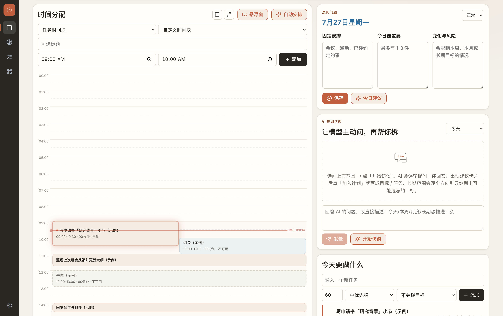
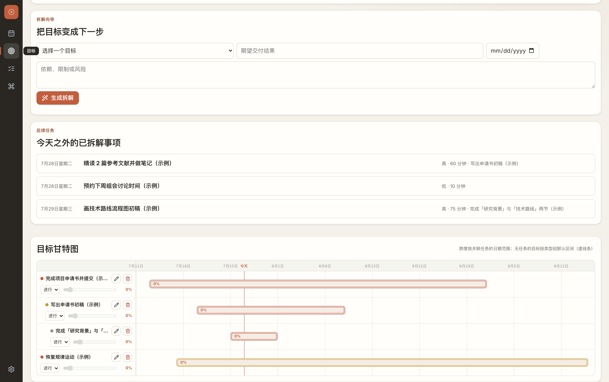
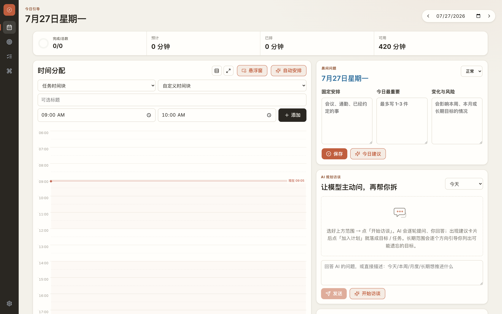

<p align="center">
  
</p>

# 计划引航 · Plan Pilot

> 会追问、帮你把大目标拆到「今天先做哪一步」的本地规划助手——不是又一个让你愧疚的待办清单。

待办清单最大的本事，就是把你没做完的事整整齐齐列出来、再让你对着它发愁。计划引航换了个路子：把脑子里那堆长期目标、今天的固定安排、临时冒出来的幺蛾子一股脑倒给它，它会像个有点啰嗦但靠谱的规划助手——先追着把信息问清楚，再把目标一层层拆细，自动绕开会议、监考、通勤这些你也搬不动的时间，最后给你排出一张真能照着做的当天日程。

适合那种「长期目标一大把、每天却总被打断」的人——科研、写作、项目申请、课程建设都对症。本地优先：填你自己的大模型 API Key 就能跑，不上传你的规划数据，也不用注册账号（连这步都帮你省了）。

作者：Yang Yu（[@YangYu-NUAA](https://github.com/YangYu-NUAA)）

贡献者：[@hrjtju](https://github.com/hrjtju)（任务编辑、目标视图、自动安排、设置等改进）、[@chen9527](https://github.com/ning-chen)（共享常量 / 助手重构、组件抽取）

## 界面一览

<p align="center">
  
  <br><em>今日视图：拖拽时间轴 + 任务清单 + AI 规划访谈同屏协作</em>
</p>

<p align="center">
  
  <br><em>目标甘特图：长期 → 月度 → 本周，大目标一眼看到落点</em>
</p>

<details>
<summary>首次打开的空状态（内置「一键填入示例一天」，点一下就能体验完整流程）</summary>
<p align="center">
  
</p>
</details>

## Android 版（原生壳）

项目内置 Capacitor Android 壳：数据只存手机本机，AI 对话与语音识别经原生 HTTP 直连供应商（绕过 WebView CORS），**不需要任何后端服务器**。

**直接安装**：在 Releases 或自行构建拿到 APK → 手机允许「安装未知来源」→ 安装。覆盖安装升级不清数据（只有主动卸载才会清）。

**首次使用**：
1. 设置（齿轮）→ 服务商选「阶跃星辰」，填聊天 API Key（只存在手机 localStorage）
2. 语音 ASR Key 填同一把；ASR 地址：Step Plan 套餐填 `https://api.stepfun.com/step_plan/v1`，非套餐填 `https://api.stepfun.com`
3. 首次点麦克风，系统弹权限允许即可

**自行构建**：见 [docs/android.md](docs/android.md)（JDK 21 + Android SDK 命令行路径，无需 Android Studio）。

**移动端专属体验**：底部导航、「当下」视图（打开即答「现在该做什么」：大字号当前块 + 秒级倒计时 + 完成/专注大按钮）、今日页「规划 / 时间表」分页、打卡震动反馈、专注模式屏幕常亮、甘特图横滑。

## 版本更新

### 2026-08-27

- AI 报错可诊断化：网络层失败（dev server 未运行 / 正在重启）不再显示误导性的「可换更稳的模型如 DeepSeek」，而是明确提示「本地 API 代理不可达：请先启动服务」；此类错误标记 fatal 直接失败，不再做无意义的三次重试。
- 文件同步失败可见：本地服务掉线时顶栏下方亮出可关闭的警告条（数据暂存于浏览器、AI 与文件同步不可用），服务恢复后自动消失；首次加载失败会先重试 3 次再提示，适配 startup.bat 的启动窗口。
- 新增排查文档 `docs/TROUBLESHOOTING.md`：AI 调用各失败模式与报错文案对照表、排查步骤、修复说明。
- 时间轴拖拽跟随滚动：拖动任务块靠近时间轴上下缘时画布自动平移；时间轴被卷出视口时页面级自动回卷把它带回来（平移差量已折算进块的时间，抓取点不漂移）；非任务卡片的选区/文件拖拽零干扰。
- 目标甘特图交互升级：条可按天对齐整体拖拽（保留时长）；时间刻度支持按钮缩放与滚轮交互（默认滚轮左右平移视角，Ctrl/Shift+滚轮以光标为锚点缩放、七档阶梯），可一键重置为适应内容；仅有手动起止日期的目标开放拖拽，派生跨度给出解释提示。
- 自动排期事件豁免：会议/聚餐/外出类事件待办在工作时段放不下时，自动落到时段外的全日空档（如晚间），且不与既有安排重叠；购票与会后整理的专项确认流不受影响。

### 2026-08-20

- Android 原生壳（Capacitor 8）：零后端运行——数据纯 localStorage，AI 对话与语音（Step Plan SSE）经原生 HTTP 直连供应商、绕过 WebView CORS，Key 只存手机本机；应用图标（罗盘品牌标）、RECORD_AUDIO 权限链路完整。新增「当下」视图（底部导航首位）：打开即答「现在该做什么」——大字号当前块、秒级倒计时、完成/专注大按钮、今日进程环。keep-awake（专注常亮）/ haptics（打卡震动）/ keyboard（输入框随键盘）三插件接入。
- 移动端布局体系：≤820px 左侧轨变底部 tab bar（safe-area）；今日页「规划 / 时间表」分页，时间轴独占全屏；语音输入区放大（46px 麦克风、16px 字号防 iOS 缩放）；触控目标全面提升；触屏设备时间轴操作按钮常驻可见；甘特图横滑 + 刻度抽稀；任务行按钮组窄屏换行。修复 schedule-panel 被 grid `min-height:0` 压成细条、flex 滚动容器底部 padding 失效两处隐藏 bug。

### 2026-08-02

- 首页产品化重构——新增「规划中枢」单卡模块：OmniBar（语音+文字同一管道）、晨间问题摘要行、AI 对话流合并为一张卡片，hairline 分隔。顶栏提示徽章去除，右栏只留「今天要做什么」，整页长度大幅塌缩。
- OmniBar 成为首页唯一输入口：含日期/时间的规则安排立即执行（「明天下午3点组会」直接排块跳日期，「周五 / 专注 / 主题」命令直达）；其余输入一律进入 AI 访谈对话，转发时按关键词首轮自动推断访谈范围（「本周」→ week、「月度」→ month、「长期」→ long，进行中的对话不被打断）。⌘K 命令条保留为全局快捷键，共用同一执行器。
- 对话区按交互展开收回：默认隐藏（中枢只有输入行 + 晨间摘要两行），输入/语音/点 ✨ 开始访谈才展开；点 × 或「加入计划」后清空收回初始形态。访谈范围选择器并入输入行；✨ 空输入=开始访谈、有文字=交给 AI。
- 表单全面降级：任务表单 / 时间块表单 / 晨间三问默认收起（小字开关、本地记忆）；任务列表默认只露前 4 条 + 逾期前 2 条，「展开全部（共 N 条）」含未来待办。首屏除 OmniBar 外零输入框。
- 语音路由收紧：语音自动执行仅限强结构化指令（排块/跳日期/命令），其余一律进 AI 访谈——不再出现随口一句话被静默建成任务的情况。

### 2026-08-01

- 新增语音输入：⌘K 命令条与 AI 访谈输入框旁都有麦克风按钮，说「明天下午3点到4点 组会」识别完成**自动执行 / 发送**（设置里可关回「落入输入框待确认」）。识别引擎二选一：默认阶跃 ASR（stepaudio-2.5-asr）——浏览器录音重编码为 16kHz 单声道 PCM/WAV，经本地服务器代理转发，API Key 不落前端、音频不经过第三方；**Step Plan 套餐自动走其专用 SSE 协议**（`/audio/asr/sse`，JSON + base64 PCM），非套餐地址走 OpenAI 兼容 multipart（阶跃标准端点 / 硅基流动 / Groq 均可）。ASR 配置与聊天完全分家：独立 Key（只存浏览器 localStorage）、独立地址与模型，回落链为「语音 Key → 聊天 Key → 服务器环境变量」。没有多模态 Key 时可在设置里切换「浏览器识别」（Web Speech API，零成本、支持流式中间结果，音频由浏览器厂商处理——隐私取舍明示给用户）。录音最长 90 秒自动停止；权限被拒 / 无 Key / 404 / 超额度等错误均内联展示上游原文，代理网络错误自动翻译为可读原因（DNS / 拒绝连接 / 超时）。

### 2026-07-27

- 时间轴新增「适配全天」密度模式：标题栏一键切换——根据当天内容范围（工作时段 + 所有时间块 ±30 分钟）与面板实际高度动态计算每小时像素（26–78px/h），全天一屏放下、不再需要内部滚动；标准 56px/h 模式原样保留，选择存本地。窗口尺寸变化时 ResizeObserver 实时重算。
- 时间轴新增全屏展开：标题栏 ⤢ 按钮弹出全屏视图（自动用适配全天密度），整天规划一览无遗；拖拽、编辑、打卡、专注全部可用，Esc 或点背景退出。
- README「界面一览」三张截图更新为当前版本（含新密度/展开按钮与空状态插画）。

### 2026-07-26

- 新增 ⌘K 全局命令条：一句话搞定日常操作——「明天下午3点到4点 组会」直接排入时间轴（自动识别固定安排）、「写周报 30分钟」建任务、「周五 / 8月1日」跳日期、「专注」进入专注模式、「主题」切换主题；↑↓ 选择、↵ 执行。全部纯本地解析（不经过大模型，零延迟），带 9 组单元测试；导航轨新增 ⌘ 入口按钮。
- 拖拽体验升级：任务拖向时间轴时显示实时「幽灵块」预览——按任务估时还原长度、5 分钟吸附、压到不可用/固定块上变红提示冲突；拖到上/下边缘自动滚动。取代原来的细虚线落点指示。
- 首次使用引导：全新用户看到三步上手卡（设工作时段 → 写第一个目标 → 排进今天），步骤完成态实时打勾，可一键填入示例数据；五个空状态全部换上贯穿罗盘品牌语言的线条插画（纯 SVG，无图片资源）。
- 中文排印精修：正文行高升至 1.58、标题字重收敛（中文大字重易显笨）、段落开启标点悬挂与 `text-wrap: pretty`（渐进增强，不支持的引擎自动忽略）。
- 任务列表 FLIP 动画：增删任务、改优先级、顺延时，其余条目从旧位置平滑滑到新位置（WAAPI 实现，尊重系统减弱动态偏好），新条目轻微上浮淡入。

### 2026-07-23

- 时间块文字自适应：块内容改为整体垂直居中（高块不再头重脚轻）；高度不足约 45 分钟的块自动进入紧凑模式——隐藏第二行时间、收紧内边距与字号，只留一行标题，完整时间与时长移到悬停 tooltip，彻底修掉「45 分钟块底部时间被裁掉」的问题；勾选与编辑按钮同步垂直居中。
- 新增专注模式：时间块 hover 或任务卡片上的 ▶ 进入全屏专注页——大倒计时圆环（呼吸动画）、显示所属目标、「完成」一键打卡、「+10 分钟」顺延块尾，Esc 退出；超时圆环变琥珀色提示加时。
- 新增桌面悬浮窗（Document Picture-in-Picture）：时间分配面板一键弹出始终置顶的迷你窗，实时显示当前/下一个时间块、剩余时间进度条与完成按钮，写代码时也能一眼看到「现在该做什么」；不支持的浏览器自动隐藏入口。
- 新增主动式每日问候：每天首次打开显示一句有具体指向的问候（昨日完成率 + 今日安排 + 最高优先级任务）；配置了 API Key 时由 AI 生成（结果缓存当天，失败自动回落），无 Key 时用本地模板同样有效；可单日关闭或永久静音。
- 微反馈系统：打勾升级为带回转的弹性动画、完成瞬间整行扫过成功色；顶栏「完成/总数」改为实时填充的圆环指标，满格变绿弹跳；复盘页新增「连续 N 天有产出」streak 徽章（纯本地推导）；可选打卡音效（Web Audio 合成、无音频文件，默认关闭）。
- 视觉纪律收束：优先级配色改为高=强调色、中/低=灰度（Linear 式色彩预算）；任务列表从卡片堆叠拍平为 hairline 分隔的行；顶栏大标题放大至 40px 并收紧字距；时间轴空白时段铺极浅斜纹，暗示「未被安排的时间」。
- 时间轴降噪：任务块统一 accent 浅底 + 细边（去掉左侧粗色条与斜纹噪点），高优先级仅以标题前小圆点提示；不可用块改灰底虚线边；半小时刻度线压至极淡；块内文字左边距全对齐（勾选按钮悬停才浮现、文字平滑让位）。
- 进行中的时间块带 accent 发光描边（随呼吸节奏明暗），一眼定位「当下」；「现在」线整体与圆点同频呼吸（此前只有点在动、线静止）。
- 全局密度下调约 10%：面板、按钮、输入框、任务行、统计卡全面收紧（100% 缩放即有此前 90% 的轻盈感）；任务表单「添加」按钮不再被栅格挤压。
- 设置抽屉修正：打卡音效复选框改为小开关样式（此前被通用输入样式撑成整宽大框）；休息时段 / 周期安排输入框改为紧凑暗色样式，与抽屉整体一致。
- 示例数据升级：一键填入后甘特图也有完整内容——长期 / 月度 / 本周三级目标带日期跨度与父子层级，外加独立长期目标共 4 条甘特横条；8 个任务覆盖今天 / 明天 / 后天与已完成状态；6 个时间块含组会、午休与一个 45 分钟块（顺手演示紧凑模式）。
- README 新增「界面一览」截图区。

### 2026-07-22

- 界面系统性重构（视觉 + 结构双线）。视觉线：补齐设计令牌体系——间距 / 圆角 / 字号 / 阴影全部按阶取用，新增成功 / 警告 / 信息 / 危险语义色（各带柔和底与墨色），全文件 60 余处硬编码颜色收口进令牌，切主题不再有色块掉队。动效从无到有：统一时长与缓动令牌，设置抽屉滑入、模态缩放弹出、视图切换整页入场、AI 建议卡片交错浮现、任务勾选弹性反馈、「现在」线呼吸脉动，并全站尊重系统「减弱动态」偏好。
- 新增「暗夜」主题：暖黑底 + 提亮黏土橙 accent，日历色块、语义色、阴影全套暗色变体，`<meta theme-color>` 随主题联动；连同原有暖象牙 / 冷蓝 / 墨灰共四套主题可选。
- 排版升级：引入 Inter Variable 可变字体（本地打包、无外网依赖，保持 local-first），数字与英文显著精致；全局抗锯齿、标题字距收紧、指标与时间数字统一 `tabular-nums` 等宽，按钮字重从 800 收敛到 700。
- 导航轨与顶栏精修：通用 Sparkles 图标换成定制罗盘品牌标志（PWA 图标同步更新）；导航按钮加悬停 tooltip 与激活指示条动画；日期切换器改为胶囊容器。
- 时间轴增强：新增工作时段背景带（一眼看出今天的可用时间）与半小时虚线刻度；时间块加细边勾勒，暗色主题下轮廓清晰。
- AI 规划访谈改为聊天界面：助手气泡带头像左对齐、用户气泡右对齐、三点跳动「正在输入」指示、新消息自动滚到底部；建议卡片补充「确认后点加入计划」引导。
- 首次使用引导：任务为空时出现「一键填入示例一天」——示例目标、任务、组会时间块一次就位，新用户立刻看到目标 / 任务 / 时间轴联动效果；`EmptyState` 组件新增操作位。
- 工作时长上限与午休改为显式设置：之前写死的「总工作时长 ≤ 10 小时」和「午休 12:00-13:00」现在都能在设置抽屉里改——新增「工作时长上限（分钟）」与「休息时段」管理（可添加 / 删除任意午休、晚间休息等时段）；未设置休息时段时保持按工作时段间隙自动推断的旧行为，老数据无缝兼容。排期冲突提示也从写死的「默认午休 12:00-13:00」改为按实际休息时段动态生成。
- 修复 StepFun 服务商配置踩坑：预设 API 地址纠正为 `https://api.stepfun.com/v1`、默认模型更新为 `step-3.7-flash`，备注写明可用模型与 Step Plan 渠道地址（`step_plan/v1`，供 step-router-v1 与订阅 Key 使用）。同时配置类错误（Key 无效 401、模型名不存在 404、地址错误）不再盲目重试三次，直接报出上游状态码与原因——比如填了不存在的模型名，能立刻看到真实报错而不是误导性的「未拿到可用 JSON」。
- 内部：App.jsx 单文件架构（5038 行）拆分为分层模块——`src/planner/`（排程、文本抽取、去重、AI 条目归一化、甘特数据，纯函数可单测、依赖无环）、`src/views/`（今日 / 目标 / 复盘）、`src/components/`（设置抽屉、时间轴、甘特图、Metric、BrandMark 等），App.jsx 收敛到约 1800 行的状态与编排层；拆分经全量「用了没导入」静态扫描 + 45 项回归测试 + 全主题截图验证，行为零变化。

### 2026-06-26

- AI 规划访谈大幅可用性提升：把每轮交互改成「显式动作」协议——模型用 `add_goal` / `add_task` / `add_busy` / `ask` 把对话内容当轮就落成条目，而不是攒到最后或只写进文字。配合长期 / 月度访谈「逐个方向追问 → 把回答逐条变成目标」的引导，现在能边问边出建议、点「加入计划」直接落库。
- 修复推理模型「正文为空、答案在思考里」导致访谈出不来建议：step-3.7-flash 等模型常把真正的 JSON 写进 `reasoning`、`content` 只吐 `{}`。现在解析层会在正文退化时从 `reasoning` 里捞出真正的最终 JSON（跳过零碎片段、取含 `message`/`actions` 的对象）；同时退化的空对象不再被当成有效结果短路返回，而是继续重试（关掉严格 json 模式 + 追问），三次都不行才报错并提示换更稳的模型。这是通用修复，今日建议 / 自动安排 / 目标拆解一并受益。
- 访谈面板加用法提示：未开始时显示「选范围 → 开始访谈 → 回答 → 出现建议点加入计划」，降低上手困惑。
- 内部：新增 `src/coachHarness.js`（动作解析 / 消息提取 / 跨轮草稿合并去重，纯函数可单测）与 `src/jsonExtract.js` 的多段 JSON 提取，附回归测试；并落了一份访谈 harness 重设计文档（`docs/COACH_HARNESS_DESIGN.md`，含后续步骤）。
- 组件抽取（@chen9527，PR #28）：把 `EmptyState`、`ErrorBoundary` 从 `App.jsx` 抽到 `src/components/`，延续模块化、零行为变化。

### 2026-06-23

- 视口布局自适应：左右栏布局占满整个视口高度，时间轴可填满剩余空间，不再出现页面外的多余滚动条。
- AI 自动排期加边界兜底：即使模型把任务排到工作时间外或午休时段，也会被自动夹回工作时段内，太短的噪声块会丢弃。提示词侧同时强化"严禁跨越边界"的约束，两道保险防止弱模型或温度漂移导致越界。
- 时间轴重叠块自动并排：之前多个时间块同时段会叠在一起看不到标题，现在自动左右并排显示；hover 时操作按钮和复选框各自在右上 / 左上，互不遮挡。
- 任务完成复选框：时间轴块和左侧任务列表都新增复选框，点击直接标记完成；已完成块半透明、标题加删除线。屏幕阅读器可识别（`role=checkbox` + `aria-checked`）。
- 目标甘特图支持手动日期：编辑目标时可填"开始 / 结束"日期，甘特条按手动日期渲染（双线边框视觉区分），不再只能依赖关联任务推断。填反向日期会被拦截并提示。
- 优先级上色修正：时间轴任务块按高 / 中 / 低优先级上色，深色主题下"低优先级"与"行政类繁忙"颜色已能区分。
- API Key 来源说明分 3 路：设置面板的 Key 提示文案现在区分"仅服务端环境变量 / 仅浏览器 / 都没"，准确说明 Key 存储位置与切换方法。
- AI 排期容错：当浏览器 + 服务端都没配置 Key 时直接报错，不再发起 400 网络请求才知道没配置。
- 顶部统计栏修复：完成/总数、预计、已排、可用 4 个指标之前会被压扁成窄条（CSS 高度塌缩 bug），现在正常显示。
- 共享常量重构（@chen9527，PR #19）：把分散在 App.jsx 的服务商预设、字体、字号等常量抽到 `src/constants/`，纯重构、零行为变化，便于后续维护。
- 共享助手与状态拆分（@chen9527，PR #27）：把日期时间工具（`addDays` / `formatHumanDate` / `toMinutes` 等）、uid 生成、默认 state、浏览器 Key 读写 hook 拆到 `src/utils/` / `src/hooks/` / `src/app/`，`App.jsx` 减少约 100 行；行为不变，`callPlanningAi` 的 API Key 改为调用方显式传入，更易复用。

### 2026-06-05

- 抗弱模型 / 推理模型：修复 step-3.7-flash 等推理模型「正文为空 / AI 返回的不是有效 JSON」。这类模型会把 token 预算先花在思考（reasoning）上，正文还没写就被长度截断；现在 JSON 调用统一给足预算下限，并识别 `finish_reason=length` 给出准确报错，而不是误判成格式错误。解析器也一并加固：剥离 JSON 前后的解释文字（字符串感知的括号配平）、支持数组根、容忍尾逗号与全角引号，抽到 `src/jsonExtract.js` 并补回归测试。
- 已给定时间的事生成固定时间块：当任务带有明确的执行时间（你或模型指定的 `start`），自动安排会把它钉成固定时间块，而不再追问“几点做”；标题里的车次 / 出发时间仍不会被误当执行时间。
- 右侧任务可拖到时间轴：从“今天要做什么”把任务拖到左侧日程，拖动时显示“放到 HH:MM”落点指示；只有撞到不可用 / 固定时间才会拒绝，其余位置都能放，下方冲突的可动块联动顺延，绝不删块。
- 日程时间轴改为完整 00:00–24:00：固定显示一整天（小时标签 0–23），容器内部滚动并自动定位到“现在”；跨过午夜会把停留在“今天”的视图自动滚到新一天，“现在”线随真实时间移动，不再出现到点就看不到指示线的情况。
- 多配色主题：内置暖橙、冷蓝清新、石墨三套主题，可在设置抽屉切换；主按钮、次按钮、徽章、焦点环、AI 气泡等全部改用主题令牌，切换后不再残留暖色（优先级红 / 黄 / 灰保留语义）。
- 目标页关联图升级为甘特图：每个目标按「自身关联任务 ∪ 子目标」的日期范围排成时间条（父目标自动包住子目标，无任务则按类型给虚线默认区间），带时间轴刻度与“今天”标线。进度联动——有子目标取子目标进度均值、否则按关联任务完成率自动汇总（进度条只读、不可拖），两者都没有时才由用户手拖；保留状态、编辑、删除与层级缩进。
- 逾期未完成任务不再消失：早于当前日期仍未完成的任务会在“今日”顶部单独列出，可一键“顺延到今天”或选日期改期，避免被遗忘。
- 界面重构为“每日驾驶舱”两栏布局：左侧日历时间轴为主、右侧引导 / 访谈 / 任务，字体、边框与配色细节向大厂官网风格靠拢。
- 修复“延期”弹层里确认 / 取消按钮宽度不一致（CSS 特异度冲突导致）。

### 2026-06-02

- 重构 AI 编排，统一“先落地、再补充、最后追问”流程：点“今日建议”或“自动安排”时，会先把固定安排里写明的事项逐条落成任务和不可用时间块，再让模型补充下一步，缺关键信息才追问一次；三个入口共用同一套落地逻辑，行为一致。
- 修复长段口语被原样复制成任务：固定安排里成段的自然语句（多件事、带“然后/以及”、含情绪描述）不再被规则机械切成一个超长任务，而是交给模型拆解；规则仅兜底识别简短、单一、清晰的条目，也不再从段落里乱解析出“固定占用”时间块。
- 今日建议改为持续引导对话：逐条落地固定任务后，会继续追问今天是否还要推进别的任务，没有合适的中长期目标时会询问是否有想做但一时难以拆解的需求，直到你回复“没有了”才收尾；多轮生成的建议会累积保留，不会在结束时丢失尚未加入的建议。
- 自动安排改为“预览 → 确认 → 撤销”：点“自动安排”先生成可预览的排期方案，确认后才会改动时间轴，应用后可一键撤销，取消则完全不改动，避免一点就被改乱且无法回退。
- 接通固定时间任务调度：带明确时间的任务会被钉到指定时间点，无固定时间的任务自动填充剩余空档并避开它们；放不下的固定时间会作为待办项提示，而不是静默丢弃。
- 减少重复：带时间的固定承诺只用一个不可用时间块表示，不再同时生成重复任务；载入时自动清理历史遗留的同名重复。
- 规则拦截时给出明确原因：当某个时间段放不下任务（例如塞不下 180 分钟）、与已有安排冲突或超出工作时段时，会在“时间分配”面板就地说明原因并给出可行的下一步，而不再静默失败。
- 界面精修：统一圆角、阴影与聚焦样式，为面板和卡片增加柔和层次，补充按钮、卡片的悬停与键盘聚焦反馈。
- “变化与风险”仅作为模型上下文参与今日建议，不再被错误地切成任务或时间块。
- 修复长会议被本地兜底遗漏：固定安排抽取的保守闸门不再单纯按字数一刀切，改为依据“多事件信号”（连接词、多个时间点、情绪/元描述）判断，单一但稍长的会议描述会被正常识别。
- 修复购票任务时间混淆：购票任务标题里的车次/出发时间不再被错误地当作执行时间钉定（例如“购买晚上 8:41 的火车票”不会被排到 20:41）。
- 加固固定安排同步：访谈前的不可用时间同步改为“落盘与返回使用同一份结果”，避免模型偶发拿到旧时间块。
- 拆分纯语义判定到 `src/planningSemantics.js`，并新增最小回归测试：运行 `npm test`（基于 Node 内置测试运行器，无需额外依赖）。
- 界面第一轮改版（视觉切片）：左侧改为窄图标导航轨（今日 / 目标 / 复盘 / 设置），工作时段、周期安排、AI 与 API Key 等收入可滑出的设置抽屉，首页不再被设置长期占据；整体配色切换为中性灰白底、石墨色文字、单一青蓝主色，黄色只表示待确认、红色只表示冲突。

### 2026-06-01

- 增加本地文件备份：浏览器数据会同步到项目目录下的 `data/`，便于在本机重启后恢复；该目录已加入 `.gitignore`。
- 增加周期安排：可维护每周重复的固定时间块；周期项修改或删除后会同步清理派生日程，避免旧安排残留。
- 改进侧栏设置：支持多个工作时段、短休息和长休息；只修改设置时也能正确恢复。
- 恢复浏览器本地 API Key 输入：Key 与规划数据分开保存，不会写入 `data/`，也不会出现在导出 JSON 中。
- 增强隐私清理：清空本地数据时会同时移除任务、目标、周期安排、用户画像和浏览器中的 API Key。
- 增加可选画像学习：默认关闭；用户主动开启后，保存复盘时才会调用当前模型更新本地画像。
- 收紧 PWA 缓存：静态资源可以离线缓存，`/api/*` 规划数据和用户画像不会进入缓存。
- 修复 AI 访谈遗漏固定安排：即使模型没有返回不可用时间块，也会从用户输入和晨间固定安排中识别带时间的会议、监考和出行，并补入日程建议。
- 增强固定安排保护：支持“下午两点”“三点半”“五点一刻”等中文时间表达；每次自动排程前会重新同步晨间固定安排，并移除与其冲突的旧任务块后重新规划。
- 修复时间块重叠：重新排程会清理历史冲突块；“今日”快捷放置会避开全部现有任务和固定安排。今日建议没有新增任务时会明确说明原因。
- 增加内置 Planning Skill Protocol：点击今日建议或开始访谈时会先同步明确固定安排，再调用模型追问或生成任务；访谈每轮统一使用结构化 JSON。

### 2026-05-30

- 完善 AI 规划访谈：减少重复目标和任务，支持将长期、月度、本周和未来任务正确写入计划。
- 改进自动时间分配：启用 AI 后会基于最新任务重新规划，并考虑午休、固定安排、依赖顺序、会前准备和会后总结。
- 增强排程稳定性：合并近似重复任务，清理历史遗留时间块，避免连续点击自动安排后重复插入日程。
- 增加手动微调：任务和时间块均可编辑；排程不确定时会提示用户补充约束。
- 调整侧栏布局：工作时段、AI 开关、服务商和 API Key 在首页首屏可见；模型和 API 地址收纳到高级设置。
- 增加隐私保护：导出数据不包含 API Key，并提供“清空本地数据”入口，方便分享和演示。

## 项目定位

- 面向需要长期目标推进的人：科研、写作、项目申请、课程建设、个人学习计划等。
- 面向每天任务经常变化的人：会议、出差、协作反馈、临时事项都会影响当天排期。
- 面向希望使用自己大模型 Key 的人：支持多家 OpenAI-compatible 服务和 Claude / Opus。
- 本地优先：没有账号系统，不上传个人规划数据，适合作为个人工具原型继续扩展。

## 适合做什么

- 早上快速收集今天的固定安排、关键任务和风险变化。
- 把长期目标拆成月度目标，再拆成本周目标和今日任务。
- 让 AI 主动追问缺失信息，辅助形成可执行任务。
- 根据工作时间、不可用时间、任务优先级和预计用时自动排期。
- 晚上复盘完成情况、阻碍和明日重点。
- 使用自己的 API Key 接入常见大模型服务商。

## 功能概览

- 今日规划：固定安排、今日重点、变化风险、精力状态、任务收集。
- 目标拆解：长期/月度/本周目标层级管理，一键生成下一层计划建议。
- AI 规划访谈：模型先问关键问题，再生成目标、任务或不可用时间块。
- 自动时间分配：避开会议、监考、通勤等不可用时间；不确定任务会提示你手动决定位置。
- 每日复盘：记录完成事项、阻碍、调整和明日焦点。
- 本地数据：计划数据保存在浏览器 `localStorage`，并同步备份到项目目录下的 `data/`。
- 周期安排：支持录入每周固定时间块，例如组会、课程和长期通勤安排。
- 数据导入导出：导出 JSON 不包含 API Key。
- 多模型接入：支持 OpenAI-compatible 和 Anthropic Messages 两类协议。
- 内置规划协议：统一模型追问、拆解和固定安排落地流程，详见 [Planning Skill Protocol](docs/PLANNING_SKILL.md)。

## 快速开始

第一次运行需要安装 [Node.js](https://nodejs.org/) 18 或更高版本，以及 [Git](https://git-scm.com/)。

### 1. 下载项目

打开终端：

- Windows：打开 PowerShell。
- macOS / Linux：打开 Terminal。

运行：

```bash
git clone https://github.com/YangYu-NUAA/plan-pilot.git
cd plan-pilot
```

`plan-pilot` 是项目文件夹。它不需要使用中文名称，也不要求放在固定位置。判断是否进入了正确目录的方法是：当前文件夹中应当能看到 `package.json`、`src/` 和 `README.md`。

如果你下载的是 GitHub ZIP 压缩包，请先解压，再进入解压后的项目文件夹。例如：

```powershell
cd "$HOME\Downloads\plan-pilot-master"
```

### 2. 安装依赖

确保终端当前位于项目文件夹中，然后运行：

```bash
npm install
```

首次安装通常需要等待一段时间。安装完成后运行：

```bash
npm run dev
```

终端出现类似下面的内容后，服务才算启动成功：

```text
VITE ready
Local: http://127.0.0.1:5173/
```

### 3. 打开页面

在浏览器访问：

[http://127.0.0.1:5173/](http://127.0.0.1:5173/)

运行期间不要关闭正在执行 `npm run dev` 的终端窗口。关闭窗口或按 `Ctrl + C` 会停止本地服务，之后再次访问 `127.0.0.1:5173` 就不会显示页面。需要重新使用时，在项目文件夹中再次运行：

```bash
npm run dev
```

### 4. 常见问题

- 页面打不开：确认终端中仍然显示 Vite 正在运行，没有回到命令提示符。
- `npm` 命令不存在：重新安装 Node.js，并关闭后重新打开终端。
- `5173` 端口被占用：Vite 会自动选择另一个端口，请打开终端中实际显示的 `Local` 地址。
- 页面显示旧内容：按 `Ctrl + F5` 强制刷新。
- 完整 AI 功能需要通过本地服务运行；不要直接双击 HTML 文件打开。

### 5. 生产构建

如需检查生产构建，可以运行：

```bash
npm run build
npm run preview
```

## 使用方法

1. 在左侧设置工作时段、短休息和长休息时间。
2. 如果需要 AI 辅助，勾选“启用 AI 辅助”，选择服务商并填写自己的 API Key。模型名和 API 地址可在“高级设置”中调整。
3. 在“今日”页填写固定安排，例如会议、监考、通勤、已约定事项。
4. 填写“今日最重要”和“变化与风险”，保存晨间规划。
5. 在任务收集中录入今天要做的任务，也可以点击“AI 今日建议”让模型主动追问或生成建议任务。
6. 点击“自动安排”，系统会按优先级、预计用时、固定时间块和会前/会后顺序排期。
7. 如果有任务无法可靠自动安排，页面会显示“需要你判断放在哪里”，你可以手动指定时间块。
8. 在“目标”页新增长期、月度或本周目标，再使用“生成拆解”得到下一层计划。
9. 在“复盘”页记录完成情况、阻碍、调整和明日重点。如需让 AI 根据复盘更新本地画像，请在高级设置中主动开启对应选项。
10. 定期导出 JSON 备份；导出的文件不会包含 API Key。分享或演示前可点击“清空本地数据”移除当前浏览器和 `data/` 中的个人内容、画像和 Key。

## AI 服务商

侧边栏可以选择常见服务商，也可以手动改模型名和 API 地址。默认预设包括：

- OpenAI：`https://api.openai.com/v1`
- DeepSeek：`https://api.deepseek.com`
- Kimi / Moonshot：`https://api.moonshot.ai/v1`
- 通义千问 / DashScope：`https://dashscope.aliyuncs.com/compatible-mode/v1`
- 智谱 GLM：`https://open.bigmodel.cn/api/paas/v4`
- 豆包 / 火山方舟：`https://ark.cn-beijing.volces.com/api/v3`
- 百度千帆 / 文心：`https://qianfan.baidubce.com/v2`
- Google Gemini：`https://generativelanguage.googleapis.com/v1beta/openai`
- OpenRouter：`https://openrouter.ai/api/v1`
- SiliconFlow：`https://api.siliconflow.cn/v1`
- 腾讯混元：`https://api.hunyuan.cloud.tencent.com/v1`
- Mistral：`https://api.mistral.ai/v1`
- xAI / Grok：`https://api.x.ai/v1`
- Groq：`https://api.groq.com/openai/v1`
- Perplexity：`https://api.perplexity.ai`
- MiniMax：`https://api.minimax.io/v1`
- MiMo：`https://api.xiaomimimo.com/v1`
- StepFun：`https://api.stepfun.ai/v1`
- Claude / Opus：`https://api.anthropic.com`
- 自定义 OpenAI 兼容接口

说明：

- OpenAI-compatible 服务通常会请求 `/chat/completions`。
- Claude / Opus 使用 Anthropic Messages API。
- 不同账号和地区可用模型名可能不同，请以供应商控制台为准。
- API Key 只保存在当前浏览器本地，不会写入仓库，也不会出现在导出 JSON 里。

## 环境变量

通常直接在页面里填写 API Key 即可。如果想通过本地环境变量提供默认 Key，可以参考 `.env.example`：

```bash
AI_API_KEY=
DEEPSEEK_API_KEY=
ANTHROPIC_API_KEY=
```

`.env` 和 `.env.*` 已在 `.gitignore` 中忽略，请不要提交真实 Key。

## 数据与隐私

- 默认没有账号系统，没有云端数据库。
- 计划数据保存在本机浏览器，并同步备份到项目目录下已忽略的 `data/`。
- API Key 独立保存在当前浏览器中，不会写入计划数据、`data/` 或导出 JSON。
- 复盘画像学习默认关闭；开启后，保存复盘时会把复盘内容发送给当前选择的大模型，并将生成的画像保存在本机 `data/user-profile.json`。
- PWA 只缓存静态资源，不缓存 `/api/*` 返回的计划数据或画像。
- API 请求通过当前 Vite dev server 的 `/api/ai/chat` 代理转发。
- 开源仓库不会包含任何个人 API Key。
- 分享给别人使用时，请让对方填写自己的 API Key。

## 给别人体验

完整 AI 功能需要本地代理，因此推荐把仓库地址发给体验者，让对方按照上方“快速开始”操作。体验者需要填写自己的 API Key。

如果只想体验非 AI 功能，也可以运行：

```bash
npm run build
npm run preview
```

## 目录结构

```text
.
├── public/                 # PWA manifest、图标、service worker
├── src/
│   ├── App.jsx             # 根组件：状态、handler、导航轨与视图切换
│   ├── views/              # 今日 / 目标 / 复盘三个视图
│   ├── components/         # 设置抽屉、时间轴、甘特图、通用 UI（Metric、BrandMark、EmptyState 等）
│   ├── planner/            # 纯函数逻辑：排程、文本抽取、去重、AI 条目归一化、甘特数据（可单测）
│   ├── hooks/              # usePlannerStore（持久化）、useLocalAiKey
│   ├── utils/              # 日期时间、uid、表单工具
│   ├── constants/          # 服务商预设、标签、应用常量
│   ├── planningSkill.js    # 内置规划协议和统一提示词
│   ├── planningSemantics.js# 句子分类 / 抽取闸门 / 购票时间守卫（纯函数，可单测）
│   ├── jsonExtract.js      # 弱模型 / 推理模型的 JSON 解析加固（纯函数，可单测）
│   ├── main.jsx            # React 入口
│   └── styles.css          # 样式与设计令牌（暖象牙 / 冷蓝 / 墨灰 / 暗夜四套主题）
├── test/                   # node:test 回归测试（npm test）
├── docs/
│   └── PLANNING_SKILL.md   # 规划协议说明与 MCP 扩展方向
├── data/                   # 本地计划备份和画像，运行后生成，不提交
├── vite.config.js          # Vite 配置和本地 AI 代理
├── package.json
├── .env.example
├── LICENSE
└── README.md
```

## 开机自启动

### Windows

1. 创建 `startup.bat`：
   ```bat
   @echo off
   cd /d <项目路径>
   start "" http://127.0.0.1:5174
   npx vite --host 127.0.0.1 --port 5174
   ```
   将 `<项目路径>` 替换为本项目实际路径。

2. 按 `Win + R`，输入 `shell:startup`，回车打开启动文件夹。

3. 右键 → 新建快捷方式 → 选择 `startup.bat` → 下一步 → 完成。

下次开机即自动在 `http://127.0.0.1:5174` 启动计划引航。

> 可将 `startup.bat` 加入 `.gitignore`，避免将本地路径提交到仓库。

## 许可证

MIT License
